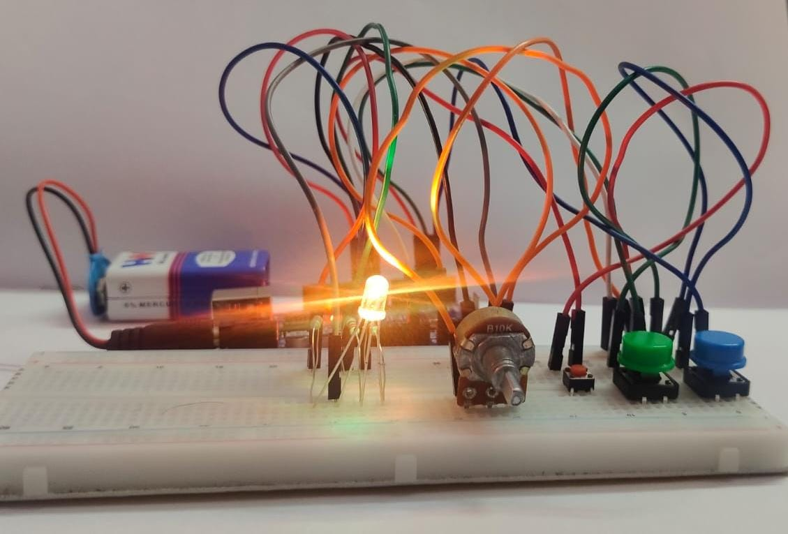
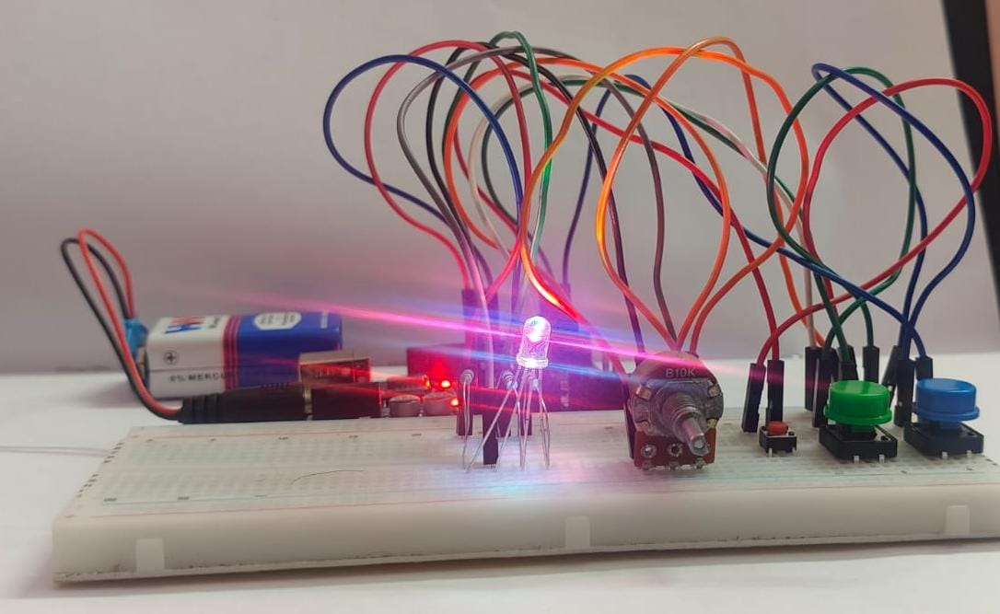
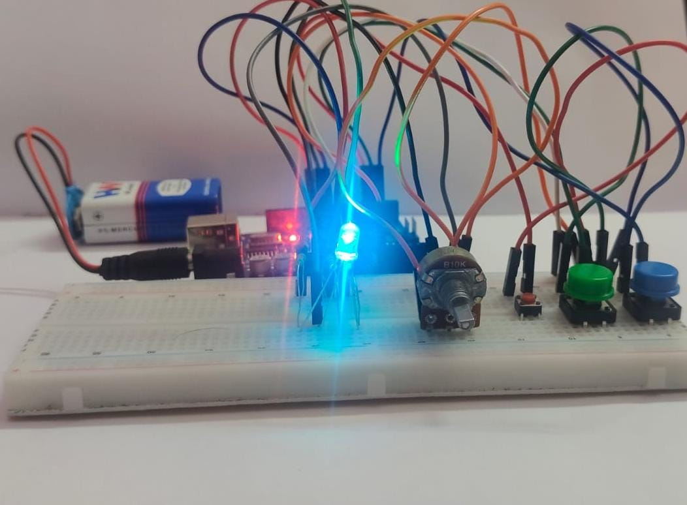
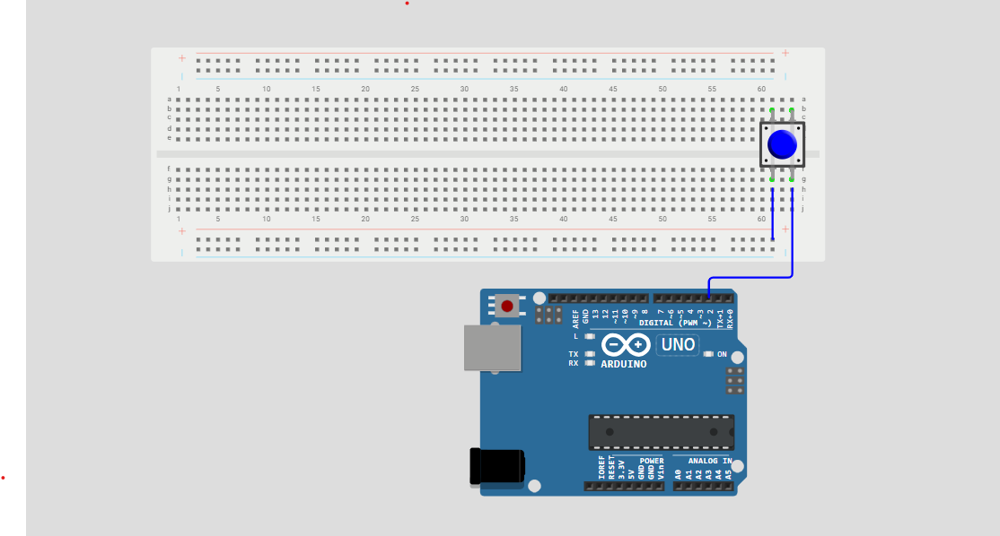
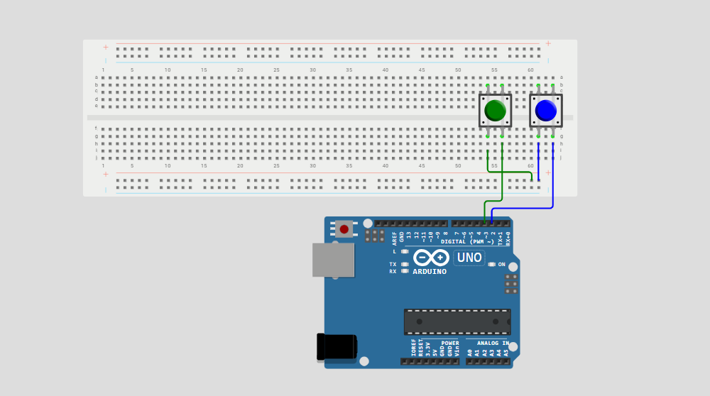
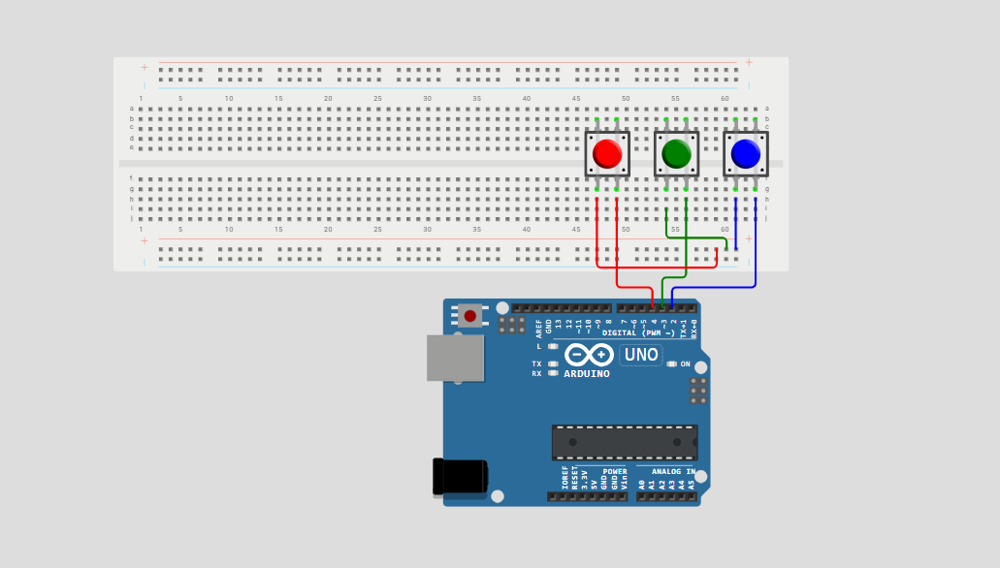
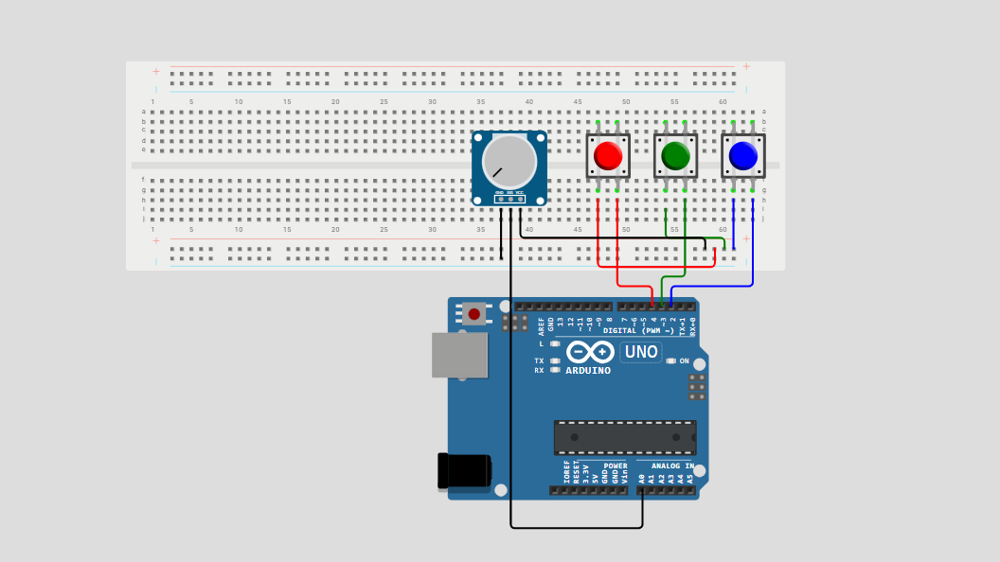
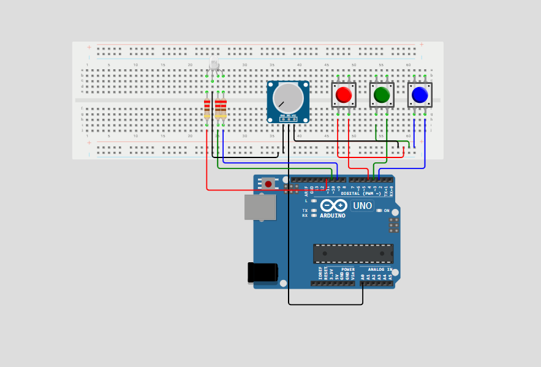
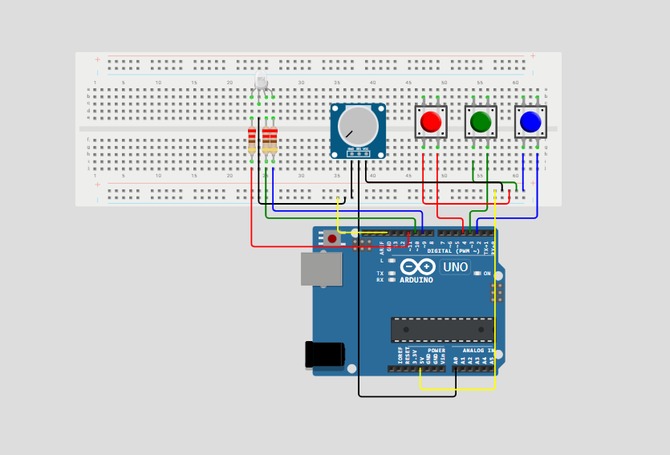

# RGB LED Brightness Controller

## Description :

This Arduino Project controls the brightness of a Common Anode RGB LED using a potentiometer and three push buttons.

Each button selects a color (Red, Green, Blue) and the potentiometer adjusts the brightness of the selected color using PWM (Pulse Width Modulation).

## Features :

- Control the brightness of a Common Anode RGB LED.
- Select Red, Green, or Blue using dedicated push buttons.
- Adjust brightness using a potentiometer.
- Uses PWM (analogWrite()) for brightness control.
- Uses the Arduino's internal pull-up resistors for button inputs.
- Beginner-friendly code with comments for easy understanding.

## Who is this project for ?

This project is intended for learners who have completed the basics of Arduino and are looking for project ideas to improve their practical skills.

Rather than introducing new concepts, this project combines familiar components and programming techniques into a complete application that you can build, understand, and modify.

## Prerequisites :

Before building this project, you should be familiar with the following Arduino concepts :
- Reading digital inputs using digitalRead()
- Reading analog inputs using analogRead()
- Controlling LED brightness using PWM (analogWrite())
- Using push buttons and a potentiometer
- Basic breadboard wiring

## Components :

| Component | Quantity |
|-------|:------:|
| Arduino Uno | 1 |
| Common Anode RGB LED | 1 |
| Push Buttons | 3 |
| 10k Potentiometer | 1 |
| Breadboard | 1 |
| Jumper Wires | 15-20 |

>**Note :** Most Arduino starter kits include all the components required for this project .

## Circuit Connections

| Arduino Pin | Connect to |
|:----:|-----|
|D9 (PWM)|220 ohm resistor, then to RGB LED Blue pin|
|D10 (PWM)|220 ohm resistor, then to RGB LED Green pin|
|D11 (PWM)|220 ohm resistor, then to RGB LED Red pin|
|D2|Blue Button|
|D3|Green Button|
|D4|Red Button|
|A0|Potentiometer (Middle Pin)|
|5V|Potentiometer (one outer pin) |
|5V|RGB LED Common Anode Pin|
|GND|Potentiometer (other outer pin) |
|GND|one terminal of three buttons|

>**Note :** 
>- Use the breadboard power rails to distribute **5V** and **GND**
>- Connect each RGB LED color pin through a 220 ohm resistor.
>- The project uses a **Common Anode RGB LED** (common pin -> **5V**)
>- Connect one terminal of each button to **GND** and the other to its Arduino pin(D2,D3, and D4)

## Working Principle :

1. Pressing the Red, Green, and Blue button selects the corresponding RGB LED color .
2. The Arduino continuously reads the potentiometer value from A0.
3. The potentiometer value is converted into brightness level using PWM.
4. The brightness is applied only to the currently selected color.
5. Pressing another button changes the selected color , allowing the potentiometer to control that color instead.
6. This process repeats continuously, enabling independent brightness control for each RGB LED color.

**Project Demonstration**
[Watch the Project Demonstration](Video/RGB_LED_Brightness_Controller.mp4)

## Step by Step Build Guide

1. Place the **Blue button** on the breadboard and then connect the Blue button to **D2** and **GND Power Rail**.

2. Place the **Green button** on the breadboard and then connect the Green button to **D3** and **same GND power rail used by the Blue button**

3. Place the **Red button** on the breadboard and then connect the Red button to **D4** and **same GND power rail used by the Blue and Green button**

4. Place the **Potentiometer** on the breadboard and then connect its **outer pins** to the breadboard **power rails** (one to the **GND Power Rail** and the other to the **5V Power Rail**).

5. Place the **Common Anode RGB LED** on the breadboard , then connect RGB LED to **D9**,**D10**, and **D11** through 220 or 330 ohm resistor and connect the common anode pin to the **5V Power Rail**

6. Now connect the Arduino **5V** and **GND** pins to the breadboard **Power Rails**.

### Wokwi Simulation

Try this project online without any hardware:
[Run the project on Wokwi](https://wokwi.com/projects/469246600490441729)

## Common Errors :

- **RGB LED doesn't light up** - Check the common anode connection and resistor wiring
- **Wrong color lights up** - Verify the Red, Green, and Blue pin connections
- **Buttons don't respond** - Check the button wiring and GND connection 
- **Brightness don't change** - Verify the potentiometer connections(5V, GND, and A0).
- **Code Upload fails** - Ensure the correct Board and COM Port are selected.